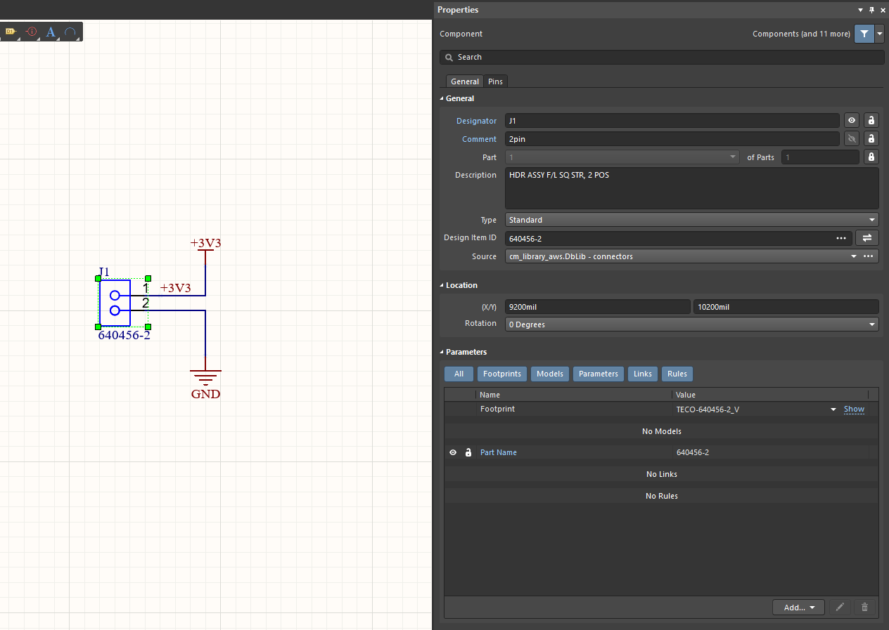
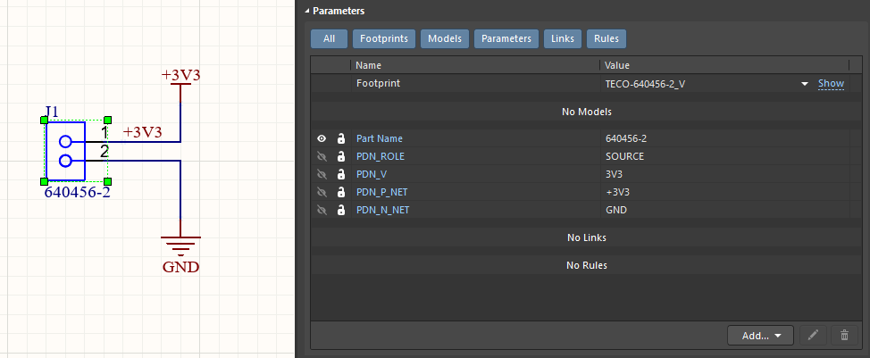

# 1. Sources and sinks — from Altium to FYPA

Before FYPA can solve your power-delivery network, it needs to know two
things about it:

- **Where the power enters the board** — the *source* (a connector,
  battery, regulator output, etc.).
- **Where the power is consumed** — the *sinks* (ICs, modules, LEDs,
  motors).

There are two ways to give FYPA this information:

- **In the Altium schematic** — add `PDN_*` parameters to the relevant
  components. The annotations live with the design and travel with the
  project files. This is the method covered in this section.
- **In the FYPA editor** — place sources and sinks directly on the board
  in the FYPA viewer, without touching the Altium schematic. The
  annotations are stored in a small `.fypa` project file beside the board.
  Covered in [Section 2 — Sources and sinks in the FYPA editor](02-sources-and-sinks-editor.md).

Use the schematic method when the PDN is a permanent part of the design
intent. Use the editor when you want to experiment, run quick "what-if"
sweeps, or annotate a board whose schematic you would rather not modify.

This section walks through annotating one source and one sink on a small
example, then importing the project into FYPA.

> **You will need:**
> - An Altium project (`.PrjPcb`) that compiles cleanly.
> - At least one component that supplies power to the board.
> - At least one component that consumes power from that supply.
> - FYPA installed (`python FYPA.py --help` should print a help screen).

## 1.1 The parameter shape

Every source or sink uses the same four parameters on one component:

| Parameter   | Purpose                                          | Example     |
|-------------|--------------------------------------------------|-------------|
| `PDN_ROLE`  | `SOURCE` or `SINK`                               | `SOURCE`    |
| `PDN_V` or `PDN_I` | Voltage (sources) or current (sinks)      | `5V` / `500mA` |
| `PDN_P_NET` | The positive / supply net name                   | `+5V`       |
| `PDN_N_NET` | The return / ground net name                     | `0V`        |

Net names must match the schematic exactly — same case, same punctuation.

### Pin overrides (single-net vs two-terminal)

Sources and sinks can tie to copper either by **net name** or by **pin
designator** on the annotated part. The parameter names depend on whether
you use a single-net check (`PDN_NET`) or a two-terminal check
(`PDN_P_NET` + `PDN_N_NET`):

| Mode | Net parameters | Pin overrides |
|------|----------------|---------------|
| Single-net | `PDN_NET` / `PDNn_NET` | `PDN_PINS` / `PDNn_PINS` |
| Two-terminal | `PDN_P_NET` + `PDN_N_NET` | **`PDN_P_PINS`** / **`PDNn_P_PINS`** and **`PDN_N_PINS`** / **`PDNn_N_PINS`** |

`PDNn_PINS` is **not** the same as `PDNn_P_PINS` — the former is for
single-net mode only; for a two-terminal sink or source use `PDNn_P_PINS`
on the P side.

> The walkthrough below adds the parameters to a placed instance, which
> is the right starting point. For parts you expect to reuse across
> designs (a regulator family, a recurring connector, an MCU), it is
> usually worth adding the `PDN_*` parameters to the **library symbol**
> instead — every future placement then arrives pre-annotated, and only
> the per-design net names need filling in. The mechanics are the same;
> you are just editing the part in the `.SchLib` rather than on a sheet.

## 1.2 Annotating a source

Example: a 5 V connector **J1**, with rails labelled `+5V` and `GND`.

**Step 1 — Select J1 in the schematic.**

Open the schematic sheet containing J1 and single-click the component body.

**Step 2 — Open the Parameters panel.**

Press `F11` (or *View > Workspace Panels > SCH > Properties*) to open the
**Properties** panel. Scroll to the **Parameters** section.



**Step 3 — Add the four parameters.**

Click **Add** below the parameter list and fill in each row:

| Name        | Value     |
|-------------|-----------|
| `PDN_ROLE`  | `SOURCE`  |
| `PDN_V`     | `3V3`      |
| `PDN_P_NET` | `+3V3`     |
| `PDN_N_NET` | `GND`      |

> `PDN_V` accepts plain numbers (`5`, `3.3`) or numbers with a `V` suffix
> (`5V`, `3.3V`). `PDN_I` accepts `0.5`, `500mA`, `0.5A`. Either form
> works. A space before the unit is tolerated (`100 mA` is the same as
> `100mA`). Engineering shorthand (`3V3`, `4k7`) and scientific notation
> (`1.5E-9`, `2.2e+6`) are also accepted.

The parameters do not have to be visible, they will be hidden by default



**Step 4 — Save the schematic** (`Ctrl+S`).

## 1.3 Annotating a sink

Example: a microcontroller **U1** drawing 500 mA from the `+5V` rail.

Select U1, open the Parameters panel, and add four rows:

| Name        | Value     |
|-------------|-----------|
| `PDN_ROLE`  | `SINK`    |
| `PDN_I`     | `500mA`   |
| `PDN_P_NET` | `+3V3`     |
| `PDN_N_NET` | `GND`      |

Save the schematic.

> FYPA solves a linear system, so `PDN_I` scales the result directly:
> doubling the current doubles the voltage drop. Use the typical current
> for normal-operation analysis, or the maximum current for worst-case
> headroom.

### Optional: `PDN_MIN_V` — minimum acceptable voltage at the sink

A sink can carry an extra `PDN_MIN_V` parameter giving the lowest
voltage the part is allowed to see at its P pins. FYPA does not change
the solve when this is set — it adds **Min V**, **Margin** and
**Status** columns to the viewer's *Nodes* tab and flags any pin whose
measured voltage falls below `PDN_MIN_V` in red (`Status = FAIL`). Sinks
without `PDN_MIN_V` show `—` in those columns.

Add it alongside the other four parameters:

| Name        | Value     |
|-------------|-----------|
| `PDN_ROLE`  | `SINK`    |
| `PDN_I`     | `500mA`   |
| `PDN_P_NET` | `+3V3`    |
| `PDN_N_NET` | `0V`      |
| `PDN_MIN_V` | `3.2`     |

The example above flags any `+3V3` pin on this sink that solves below
3.2 V. Pick the value from the part's datasheet — typically the minimum
supply voltage in the operating-conditions table.

> `PDN_MIN_V` accepts the same value forms as `PDN_V` — `3.2`, `3.2V`,
> etc. For multi-channel sinks (an IC with several independent supply
> rails on one part), use `PDN<n>_MIN_V` per channel, matching the
> `PDN<n>_I` numbering.

## 1.4 Multi-pin parts

For a two-pin part such as J1, FYPA infers which pad is which from
connectivity. For an IC with multiple supply and ground pins, FYPA
groups **every pad** on that component that connects to `PDN_P_NET` as
one terminal, and every pad on `PDN_N_NET` as the other. A BGA with
twelve `+5V` balls and twenty `0V` balls works without any pad
enumeration.

Only pads **directly** on the named net are included — FYPA does not
pull in pads from other nets on the same part because a `SERIES`
directive bridges those nets elsewhere on the board. Name the net that
the pad actually sits on in the PCB netlist (see 1.8 if the pin is on
a switching node or pre-inductor net).

To override the inferred pad set for one terminal (e.g. a single rail on
a simple part), use `PDN_P_PINS` / `PDN_N_PINS` as documented in the
[main README](../../README.md). For multi-rail ICs those lists are awkward
in a SchLib because channel indices (`PDN` / `PDN1` / …) are board-specific.

### Restricting which pins may join (allowlist)

Enable pins hard-tied to a supply, or signal pins pulled to GND, sit on
the same net as the power pads but should not carry load current. Prefer a
**part-wide allowlist** in the library — independent of channel indices —
then let net matching partition pins across rails:

1. **`PDN_PINS_ONLY`** (preferred in the SchLib) — comma/whitespace list of
   pin designators that may join any SOURCE/SINK/SERIES/REGULATOR terminal.
   Pads not on the list are never considered, even when they sit on
   `PDN_P_NET` / `PDN_N_NET`.
2. **`PDN_EXTRA_PINS`** — always **unioned** into the allowlist. Typical use:
   library sets `PDN_PINS_ONLY`, the schematic instance adds one forgotten
   pin via `PDN_EXTRA_PINS` without retyping the list. If **only**
   `PDN_EXTRA_PINS` is set (no `PDN_PINS_ONLY`), that list **is** the full
   allowlist — it does *not* mean “all pads plus these”.
3. **Per-terminal override** — `PDN[_n]_P_PINS` / `PDN[_n]_N_PINS` (or
   single-net `PDN[_n]_PINS`) bypasses the allowlist for that terminal.
4. **Exclude (fine-tuning)** — pin parameter `PDN_IGNORE` = `1` (also
   `TRUE` / `YES` / `IGNORE`; alias name `PDN` value `IGNORE`), or
   component `PDN_IGNORE_PINS` / `PDNn_IGNORE_PINS`, removes pins after
   matching (including from an explicit include list). Prefer
   `PDN_IGNORE_PINS` on the part when pin-owned parameters are not visible
   to FYPA (unusual SchLib hierarchy); the pin-level form needs the
   parameter's OwnerIndex to point at the pin record.

`PDN_PINS_ONLY` / `PDN_EXTRA_PINS` are **unindexed** (part-wide). Indexed
forms such as `PDN1_PINS_ONLY` are ignored with a warning.

Example — multi-rail IC in the SchLib with power pins `1`–`4` and `EP`,
enable pin `EN` hard-tied to `+3V3` on the board:

| Name | Value |
|------|-------|
| `PDN_PINS_ONLY` | `1,2,3,4,EP` |
| `PDN_ROLE` | `SINK` |
| `PDN_I` | `500mA` | `PDN_P_NET` = `+3V3`, `PDN_N_NET` = `GND` |
| `PDN1_I` | `250mA` | `PDN1_P_NET` = `+1V8`, `PDN1_N_NET` = `GND` |

`EN` never joins the `+3V3` terminal. On one board, add a forgotten sense
pin with `PDN_EXTRA_PINS=SNS` on the placed part.

### Area-weighted multi-pin coupling

By default each pin of a multi-pin terminal couples through the same
star resistance. For parts with differently sized power pads (or a large
QFN thermal pad on GND), open **Settings** and enable **Weight multi-pin
coupling by pad area**. Coupling resistance then scales as
`R ∝ 1/A`, so larger pads take a larger share of current when copper
access is similar. Off by default.

Marker hover text uses the same area weights as a quick estimate
(`I · A_i / ΣA`). Areas come from each pin's pad outline polygon on its
terminal layer (not a multi-layer copper volume). The FEM can still shift
current when copper access to the pads differs — the hover value is not a
guaranteed pin current.

### Several rails on one part (multi-channel)

An IC that draws from more than one supply rail is a single part with
several **channels**. Keep the first directive unindexed and add numbered
channels by appending an integer to `PDN` — each channel gets its own
value and its own P/N nets:

| Name        | Value   | Name         | Value  |
|-------------|---------|--------------|--------|
| `PDN_ROLE`  | `SINK`  |              |        |
| `PDN_I`     | `500mA` | `PDN_P_NET`  | `+3V3` |
|             |         | `PDN_N_NET`  | `GND`  |
| `PDN1_I`    | `250mA` | `PDN1_P_NET` | `+1V8` |
|             |         | `PDN1_N_NET` | `GND`  |
| `PDN2_I`    | `50mA`  | `PDN2_P_NET` | `+5V`  |
|             |         | `PDN2_N_NET` | `GND`  |

Each channel becomes its own directive; the viewer labels them `U7`,
`U7#1`, `U7#2`. A channel exists as soon as its value parameter
(`PDN<n>_I` here) is set. Indices can be sparse (gaps allowed). The same
scheme works for every role — use `PDN<n>_V` for sources/regulators,
`PDN<n>_R` for series parts. See the [main README](../../README.md#multi-channel-directives)
for the full reference.

> You only need channels for **different** rails. An IC with many pins on
> the *same* rail is still one directive — FYPA already groups every pad
> on `PDN_P_NET` into one terminal (see [Multi-pin parts](#14-multi-pin-parts)
> above).

### A part that both sources and sinks (mixed roles)

`PDN_ROLE` is the part-wide **default**, but any channel can override it
with `PDN<n>_ROLE`. That is how one physical component can be **both a
source and a sink** — for example a DAC whose supply pins sink current
while its outputs source current:

| Name        | Value      | Name         | Value      |
|-------------|------------|--------------|------------|
| `PDN_ROLE`  | `SINK`     |              |            |
| `PDN_I`     | `80mA`     | `PDN_P_NET`  | `AVDD`     |
|             |            | `PDN_N_NET`  | `GND`      |
| `PDN1_I`    | `20mA`     | `PDN1_P_NET` | `DVDD`     |
|             |            | `PDN1_N_NET` | `GND`      |
| `PDN2_ROLE` | `SOURCE`   | `PDN2_V`     | `2.5`      |
|             |            | `PDN2_P_NET` | `DAC_OUT0` |
|             |            | `PDN2_N_NET` | `GND`      |
| `PDN3_ROLE` | `SOURCE`   | `PDN3_V`     | `1.8`      |
|             |            | `PDN3_P_NET` | `DAC_OUT1` |
|             |            | `PDN3_N_NET` | `GND`      |

Channels 0–1 inherit the default `SINK` role (the AVDD/DVDD supplies);
channels 2–3 override to `SOURCE` (the two outputs). Only the channels
that differ from the default carry a `PDN<n>_ROLE` — a plain two-sink part
needs no role overrides at all.

When every active channel has its own role, you may omit `PDN_ROLE`
entirely and set only `PDN<n>_ROLE` on each indexed channel — for example
a part that SERIES-bridges the input rail and SINKs quiescent current on
a separate IC supply:

| Name         | Value          | Name          | Value          |
|--------------|----------------|---------------|----------------|
| `PDN1_ROLE`  | `SERIES`       | `PDN1_R`      | `7m`           |
|              |                | `PDN1_P_NET`  | `VIN`          |
|              |                | `PDN1_N_NET`  | `VOUT`         |
| `PDN2_ROLE`  | `SINK`         | `PDN2_I`      | `10mA`         |
|              |                | `PDN2_P_NET`  | `VCC`          |
|              |                | `PDN2_N_NET`  | `GND`          |

Each indexed channel must then declare its role explicitly; channels
without `PDN<n>_ROLE` and without a part-wide `PDN_ROLE` are rejected.

A few things to keep in mind:

- Mix roles across **different** nets. A source and a sink on the *same*
  net of one part just feed current back into each other.
- If the part is really an input→output **converter** (its output current
  is drawn from an input rail via a gain), model it as a single
  `REGULATOR` instead — see [Section 4](04-regulators.md).
- A `SOURCE` fixes voltage, not current. To impose a known output current,
  set it on the **load** sink at the far end of the output net; the DAC
  output then supplies exactly that current through the output copper.

## 1.5 Pre-import checks

Before launching FYPA:

- **Compile the project in Altium** (*Project > Compile PCB Project*).
  FYPA reads the same files Altium does; compile errors block the read.
- **Verify the net names** match the names actually on the PCB. Hover
  over a wire on the schematic to see the net name in the status bar,
  or open *Design > Netlist > Edit Nets* on the PCB to see the
  authoritative list.
- **Save all files** (`File > Save All`). FYPA reads from disk, not
  from unsaved Altium buffers.

### Blanket / Parameter Set workflow

To attach the same `PDN_*` parameters to a group of components without
placing them on every symbol:

1. Draw a **Blanket** around the components on the schematic.
2. Place a **Parameter Set** on the blanket edge and add `PDN_ROLE`,
   `PDN_V` / `PDN_I`, and `PDN_P_NET` / `PDN_N_NET` (or `PDN_NET`).
3. **Compile the project** and **synchronise with the PCB** so Altium
   copies the parameters onto each component (`Project > Compile PCB
   Project`, then apply the ECO).
4. Launch FYPA — it reads the `PDN_*` values from the **PCB component
   parameters** (not from the blanket graphic itself).

### Local net names (hierarchical / reused sheets)

`PDN_P_NET`, `PDN_N_NET`, and `PDN_NET` may use the **local net name
as it appears on the schematic sheet** where the directive applies
(for example `VCC_EFUSE` on `efuse.SchDoc`, or `+3V3` on a child
sheet). FYPA compiles the schematic netlist and maps that label to the
correct PCB pads **per component instance** — independent of how
Altium names channels on the PCB (`R63.4`, `J3_SL8M7`, `CAN.RX1`, …).

Resolution order:

1. **Direct PCB net name** — if the parameter already names a flattened
   PCB net (e.g. `VCC_EFUSE.4`), FYPA uses it as-is.
2. **Local name via schematic pins** — the compiled netlist finds which
   pin(s) carry the local label on the inferred sheet; FYPA selects the
   matching pad(s) on that PCB instance (primary path for repeated sheets).
3. **Netlist aliases** — when Altium compiles channel-qualified aliases
   (`VDD_5V0.4`, `MDI.TD_P4`, …), FYPA cross-checks pad connectivity.

Physical PCB net names still work unchanged. You do **not** need to look
up flattened PCB net names when authoring on a child sheet.

#### Repeated sheets (REPEAT)

A sheet symbol placed multiple times (e.g. `vip-port.SchDoc` × 4, each
containing `efuse.SchDoc`) creates several PCB instances of the same
schematic designator (`R63` → `R63.1` … `R63.4`). Use the **local**
net label from the child sheet in `PDN_*_NET` — FYPA binds each
instance to its own slot net (`VCC_EFUSE.1` … `VCC_EFUSE.4`) via pin
connectivity, not by parsing your `ChannelDesignatorFormatString`.

Example — a 0 Ω link `R63` on `efuse.SchDoc` inside a repeated VIP port:

| Parameter      | Value        |
|----------------|--------------|
| `PDN_ROLE`     | `SERIES`     |
| `PDN1_R`       | `0.01`       |
| `PDN1_P_NET`   | `VDD_5V0`    |
| `PDN1_N_NET`   | `VCC_EFUSE`  |

The same parameters on every instance; FYPA resolves `VCC_EFUSE` to
`VCC_EFUSE.N` per placement. A log line such as
`resolved local net 'VCC_EFUSE' via schematic pins ['2'] → PCB net(s) VCC_EFUSE.4`
is expected and not an error.

#### PCB-only parameters (Blanket / ECO)

When `PDN_*` parameters are pushed to the PCB only (Blanket rule or ECO),
FYPA infers the originating schematic sheet from pad ↔ netlist
connectivity so local-net resolution stays scoped to that instance.

#### Troubleshooting local nets

| Symptom | Likely cause | Fix |
|---------|--------------|-----|
| `net 'FOO' does not exist on the PCB and could not be resolved as a local schematic net` | Project does not compile / netlist unavailable | Compile the schematic; re-open the project in FYPA |
| Same message, project compiles | Wrong local label or wrong sheet | Check the net label on the child sheet matches `PDN_*_NET` exactly |
| `component … has no pad on net FOO` | Slot-qualified name on the wrong instance (e.g. `FOO.3` on channel 1) | Use the local name `FOO` instead of a channel suffix |
| `resolved local net … via schematic pins` (warning) | Normal for repeated sheets | No action needed — mapping succeeded |

> If resolution still fails, verify that the component's schematic
> designator matches the PCB `source_designator` and that the project
> compiles without errors.

## 1.6 Importing into FYPA

### Option A — From the terminal

Open a terminal in the FYPA install directory and run:

```sh
python FYPA.py gui path\to\YourBoard.PrjPcb
```

FYPA will:

1. Read the `.PrjPcb` and every `.PcbDoc` / `.SchDoc` it references.
2. Find every component carrying `PDN_*` parameters (on the schematic
   symbol or on the PCB after a Blanket/Parameter-Set sync).
3. Build a 2-D copper geometry per layer, per net.
4. Run the FEM solve.
5. Open the interactive viewer.

The first solve on a fresh project typically takes ten seconds to a
minute, depending on board size and layer count. Subsequent launches on
the same unchanged project are served from cache in under a second.

> Using the prebuilt executable? Run `FYPA.exe gui path\to\YourBoard.PrjPcb`
> from a terminal in the folder containing `FYPA.exe`, or drag the
> `.PrjPcb` file onto `FYPA.exe` in Explorer.

### Option B — From inside Altium

A DelphiScript launcher (`packaging/Run_FYPA.pas`) runs FYPA against the
currently focused project. Setup is documented in the
[main README](../../README.md#launching-directly-from-altium). Once
registered, right-clicking *Run* in the Script Editor opens a console
window and launches the viewer on the focused `.PrjPcb`.

## 1.7 What you should see

The viewer opens showing one copper layer shaded by voltage. The side
panel lists:

- Every layer in the stackup.
- Every **rail** FYPA inferred from the `PDN_P_NET` / `PDN_N_NET` pairs
  (in this example, `+5V → 0V`).
- A **Nodes** tab with one row per terminal pin and its solved voltage.

Switching the display mode from *Voltage* to *Current Density* shows
the current flow across the copper from source to sink.

## 1.8 Troubleshooting

| Message or symptom                                | Likely cause                                                        | Fix                                                                          |
|---------------------------------------------------|---------------------------------------------------------------------|------------------------------------------------------------------------------|
| `No PDN_* directives found`                        | No component carries `PDN_ROLE`.                                    | Re-check that the schematic was saved. Parameter names are case-sensitive.   |
| `Net "+5V" not found on PCB`                       | The net named in `PDN_P_NET` does not exist on the routed board.    | Check spelling against the PCB net list (see 1.5).                           |
| `component … has no pad on net …`                  | No pad of this part sits on the named net (e.g. buck pin on the switching node, output rail only after the inductor). | Set `PDN_*_NET` to the net the pad is actually on, or place the directive on the correct component. |
| `Open loop on net …` / source without sink         | A rail has a source but no sink, or vice versa.                     | Add the missing end. Every source needs at least one sink on the same rail.  |
| Viewer opens but the layer is blank                | The selected layer has no copper on the selected rail.              | Switch layers or rails in the side panel. If all are blank, check copper net assignments on the PCB. |

For a faster diagnostic without running the full solve, use:

```sh
python FYPA.py load path\to\YourBoard.PrjPcb
```

This prints a solve-readiness report covering parameter parsing, net
resolution, and geometry extraction, then exits.

## Next steps

The same parameter pattern extends to the other directive types:

- Multiple rails — annotate a source and at least one sink per rail.
- On-board regulators (LDO, buck) — use `PDN_ROLE=REGULATOR`.
- Fuses, sense resistors, ferrites — use `PDN_ROLE=SERIES`.
- "What-if" analyses without editing the schematic — use editor mode in
  the viewer.

Each of these is covered in a later section.
